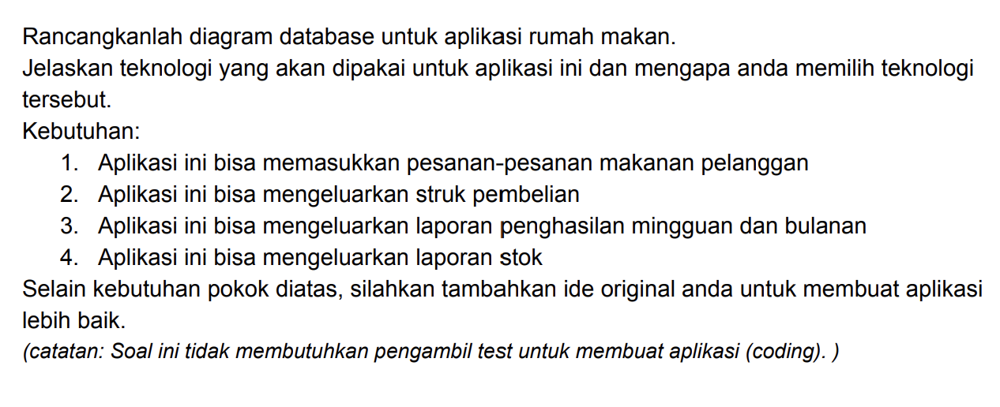
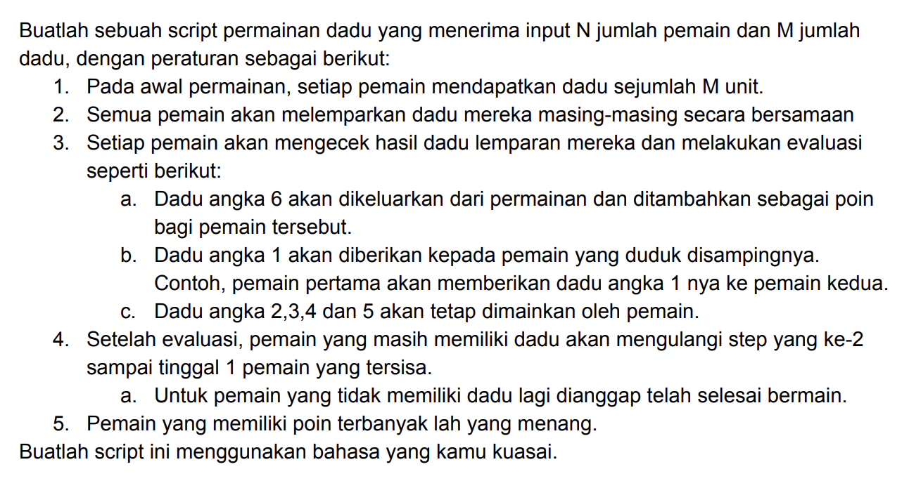

## Soal Teori



### Jawaban


#### Tech Stack

**Client:** ReactJS / NextJS, Redux, TailwindCSS

**Server:** Go, gorm, PostgreSQL, Redis

## Soal Praktek


### Jawaban
Menjalankan program logic permainan dadu 

```bash
  go run diceGame.go -N=3 -M=4
```
#### Keterangan Flag

- N adalah jumlah pemain

- M adalah jumlah dadu
